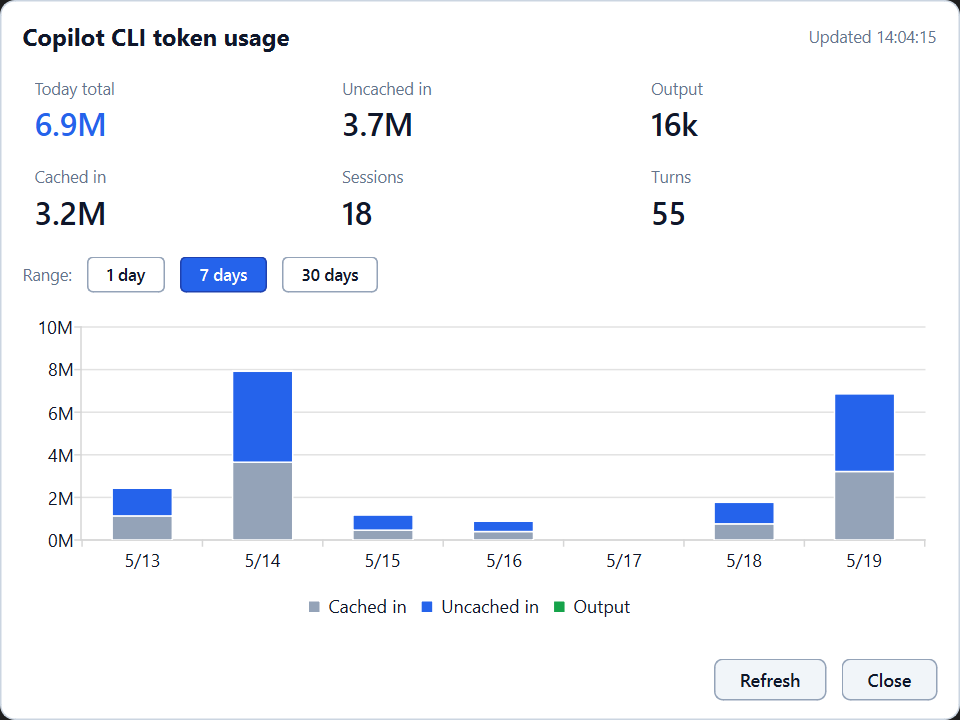

# TokenTray

A lightweight Windows **system tray app** that shows your live **GitHub Copilot CLI** token usage, parsed from local telemetry logs. No network calls, no extra accounts — just a number in your tray and a click-away breakdown.



## What it does

- **Tray icon** shows today's total tokens at a glance (`6.9M`, `124k`, `0`, …)
- **Hover** for a tooltip with turn / session counts and last refresh time
- **Click** for a popup with:
  - Today's totals broken down into Uncached input / Output / Cached input / Sessions / Turns
  - A stacked bar chart you can switch between **1 day** (hourly), **7 days**, or **30 days**
- **Auto-refresh** every 2 minutes; manual **Refresh** button in the popup
- **Auto-start at login** (optional, one command)

Scope is local Copilot **CLI only** (mirrors the "Agency" usage in the Microsoft IT report). It does **not** include the IDE Copilot, Clawpilot, M365 Copilot, or cloud Coding Agent — those emit telemetry elsewhere.

---

## Install

### Option 1: Download the prebuilt zip (recommended)

1. Grab the latest `TokenTray-vX.Y.Z-win64.zip` from the [Releases](https://github.com/jeffjame_microsoft/TokenTray/releases) page.
2. Extract it anywhere (e.g., `C:\Tools\TokenTray\`). The whole folder is the app — don't move individual files out of it.
3. Double-click `TokenTray.exe` inside the extracted folder. The tray icon appears in your system tray (look under the `^` overflow if you don't see it).
4. *Optional:* run once with `--install-startup` to launch at every login:
   ```powershell
   .\TokenTray.exe --install-startup
   ```

> ⚠️ **Why a zip and not a single `.exe`?** PyInstaller's onefile mode extracts DLLs to `%TEMP%` on launch, where Windows Defender's real-time protection rewrites them and trips the OS code-integrity check (`STATUS_INVALID_IMAGE_HASH` / "Bad Image"). The onedir folder bundle avoids the temp extraction and runs cleanly.

> ⚠️ **Windows SmartScreen** may warn the first time you run `TokenTray.exe` because the binary is not code-signed. Click **More info → Run anyway**. The `.sha256.txt` file alongside the release lets you verify integrity if you want.

### Option 2: Run from source (developers)

Requirements: Python 3.11+ on Windows.

```powershell
git clone https://github.com/jeffjame_microsoft/TokenTray.git
cd TokenTray
py -m venv .venv
.\.venv\Scripts\pip install -e .
.\.venv\Scripts\pythonw run.pyw          # run once
.\.venv\Scripts\python install_startup.py # autostart at login
```

---

## Usage

| Action | Result |
|---|---|
| Left-click the tray icon | Open the details popup |
| Right-click the tray icon | Menu: Show details / Refresh now / Quit |
| Hover the tray icon | Tooltip with today total + turn/session counts |
| `1 day` button | Hourly bars for today |
| `7 days` button (default) | Daily bars, 7-day stacked |
| `30 days` button | Daily bars, 30-day stacked |

CLI flags (work for both the `.exe` and `python tray_app.py`):

```text
--install-startup       Add a Startup-folder shortcut for auto-launch
--uninstall-startup     Remove it
--version               Print version and exit
```

---

## How it works

`usage_core.py::iter_usage_events()` scans every `*.log` under
`~/.copilot/logs/` for `[Telemetry] cli.telemetry:` blocks where
`kind == "assistant_usage"`. From each block it extracts:

- ISO timestamp (from the log-line prefix)
- `session_id`
- `metrics.input_tokens` / `output_tokens` / `cache_read_tokens` / `cache_write_tokens`

The CLI emits `input_tokens` as "new + cache-write tokens billed at base rate" (cache-write is a subset of input). So the displayed total is:

```
Total = cached_in + input + output
```

…which matches the Microsoft IT usage-report breakdown.

---

## Building from source

> The build venv must use **Python 3.12** (not 3.14). PyInstaller's `--onefile` mode also produces "Bad Image" errors on launch under any Python version because Defender tampers with the temp-extracted DLLs, so we build `--onedir` and zip the result. The CI workflow does the same.

```powershell
# One-time: set up a 3.12 venv just for building
py -3.12 -m venv C:\PythonEnvs\TokenUsageTray-build312
C:\PythonEnvs\TokenUsageTray-build312\Scripts\pip install -r requirements.txt "pyinstaller>=6.3"

# Build
.\build.ps1                     # produces dist\TokenTray\ (onedir, ~100 MB)
.\build.ps1 -Clean              # nuke build/dist first
.\build.ps1 -Mode onefile       # try onefile (will likely hit Bad Image on launch)
```

`build.ps1` auto-prefers the 3.12 build venv if it exists; otherwise it falls back to the daily-run venv.

The release process (manual until EMU policy permits hosted Actions runners):

```powershell
.\build.ps1 -Clean
Compress-Archive dist\TokenTray\* dist\TokenTray-vX.Y.Z-win64.zip -Force
(Get-FileHash dist\TokenTray-vX.Y.Z-win64.zip -Algorithm SHA256).Hash + "  TokenTray-vX.Y.Z-win64.zip" |
    Out-File -Encoding ASCII dist\TokenTray-vX.Y.Z-win64.zip.sha256.txt
git tag -a vX.Y.Z -m "vX.Y.Z"
git push origin vX.Y.Z
gh release create vX.Y.Z dist\TokenTray-vX.Y.Z-win64.zip dist\TokenTray-vX.Y.Z-win64.zip.sha256.txt --generate-notes
```

A `.github/workflows/release.yml` is in the repo for the day GitHub-hosted runners are allowed on this EMU tenant; it will automatically build and publish the same artifacts on every `v*` tag push.

---

## File layout

```
TokenTray\
├── tray_app.py           # QApplication + QSystemTrayIcon + refresh timer
├── popup_window.py       # Frameless popup + 1/7/30-day chart
├── icon_renderer.py      # Tray badge with today-token-count overlay
├── usage_core.py         # Telemetry log parsing + day/hour bucketing
├── install_startup.py    # Startup-folder shortcut install/remove
├── run.pyw               # pythonw entry point (no console)
├── build.ps1             # PyInstaller build script
├── pyproject.toml        # Package metadata + entry points
├── requirements.txt      # Runtime deps (kept for backward compat)
├── tools\
│   └── make_icon.py      # Regenerate assets\tokentray.ico
├── assets\
│   └── tokentray.ico     # App icon (committed; PyInstaller bundles it)
└── .github\workflows\
    └── release.yml       # CI build & release on tag push
```

---

## License

[MIT](LICENSE) © 2026 Jeff James
